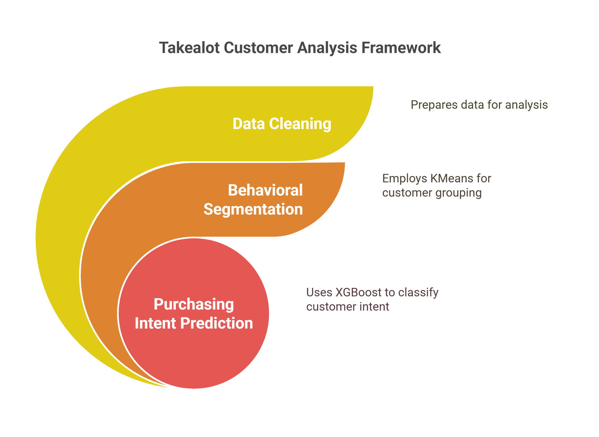

# 🛍️ Takealot Shopper Insights – Behavioral Segmentation & Predictive Modeling

This project analyzes online shopper behavior using a machine learning pipeline incorporating Unsupervised & Supervised Learning:



This six weeks project culminates into a Python Shiny web app that offers a sleek, interactive interface to explore online shopper behavior using machine learning. It leverages **KMeans clustering** to segment customers and **XGBoost** to predict purchasing intent.

🔗 **Live Demo**: [Takealot Shopper Insights App](https://mubanga-nsofu.shinyapps.io/takealot_shopper_insights/)

---

## 📊 Features

- 📁 Upload the provided cleaned `.csv` dataset
- 📌 Segment customers using **KMeans Clustering**
- 🔮 Predict purchase intent using **XGBoost Classifier**
- 🧠 SHAP analysis for feature importance
- 📉 Clean visualizations and user-friendly layout
- 🖼️ Modern UI with two-tab navigation and Takealot branding

---

## 🤖 Models Used

| Task            | Algorithm | Purpose                        |
|-----------------|-----------|--------------------------------|
| Clustering      | KMeans    | Behavioral segmentation        |
| Classification  | XGBoost   | Purchase intent prediction     |

---

## 📁 Folder Structure

```plaintext
.
├── takealot_app.py                  # Main Shiny app script
├── models/
│   ├── kmeans_model.pkl             # Pre-trained KMeans model
│   └── xgboost_model.joblib         # Pre-trained XGBoost model
├── requirements.txt                 # Python dependency list
├── image/
│   └── Takealot_Framework.png       # Analytical framework diagram
└── README.md                        # This documentation file
```

---
⚙️ Setup Instructions
Clone the repository:

git clone https://github.com/YOUR_USERNAME/takealot-shopper-insights.git
cd takealot-shopper-insights


---
📂 Dataset
The app expects a cleaned version of the Online Shoppers Intention dataset as input. You can upload your own CSV file for live prediction and segmentation.

---

📽️ Final Project Requirements (Academic)
This project satisfies Nexford’s final capstone module requirements:

✅ End-to-end machine learning pipeline

✅ Dashboard UI using Shiny for Python

✅ Deployment to cloud (shinyapps.io)

✅ GitHub code versioning

✅ Embedded self-recorded presentation

✅ Interpretability via SHAP

---

📢 Author
Mubanga Nsofu

MSc Data Analytics Candidate
GitHub

---
📝 License
This project is for academic and educational use. Contact the author for extended licensing and commercial rights.
---
