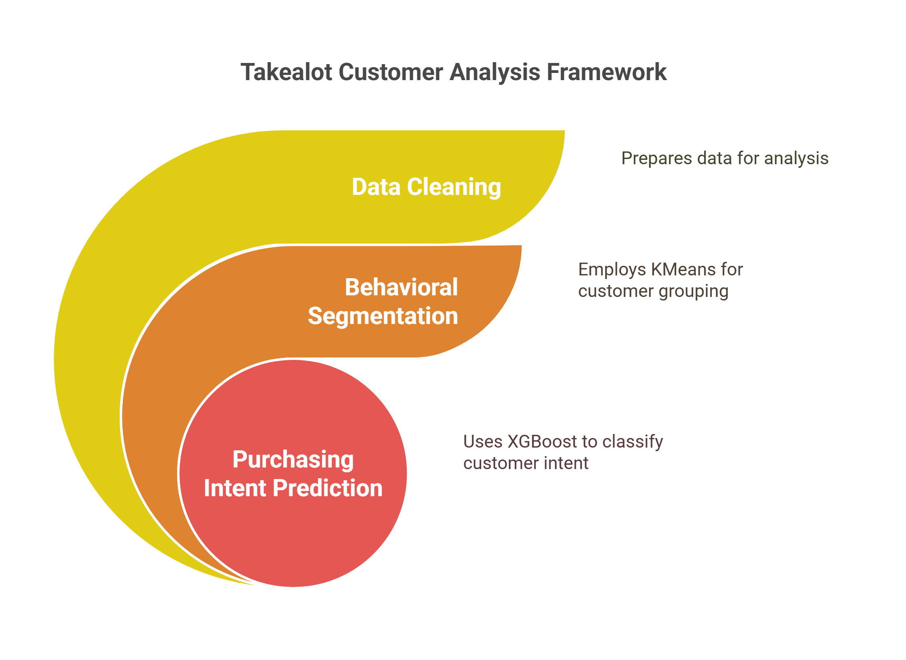

# 🛒 Takealot Online Customer Behavioral Segmentation and Intent Prediction

This project analyzes online shopper behavior using a structured machine learning pipeline. It is divided into three main notebooks, each corresponding to a key stage in the data science process:




This visual framework illustrates the layered approach taken in this project from week 3 into week 4:

### 1. 🧹 Data Cleaning (Week 3 - Milestone 3, completed last week)
**Notebook:** `Data_Preparation.ipynb`  
**Key Actions:**
- Handles missing values, duplicates, outliers, and skewness
- Scales and standardizes features
- Encodes categorical variables
- Reduces dimensionality using PCA
- Generates clean dataset called online_shoppers_Intention_cleaned.csv which is required for week 4 modeling below.

### 2. 🧠 Behavioral Segmentation (Week 4)
**Notebook:** `Clustering_Analysis.ipynb`  
**Key Actions:**
- Performs PCA-based dimensionality reduction
- Uses Calinski-Harabasz scores for optimal k
- Applies KMeans clustering
- Profiles clusters based on metrics such as `PageValues`, `BounceRates`, `Interaction_Intensity`
- Evaluates clustering quality using Davies-Bouldin Score

### 3. 🎯 Purchasing Intent Prediction (Week 4)
**Notebook:** `Purchasing_Intent_Classifier.ipynb`  
**Key Actions:**
- Applies XGBoost and Logistic Regression with hyperparameter tuning (Optuna)
- Handles class imbalance using SMOTE 
- Visualizes model performance with ROC and Precision-Recall Curves
- Applies SHAP for interpretability
- Assesses overfitting using train/test metrics and cross-validation
- Predicts whether a user will generate revenue (i.e., make a purchase).
**Evaluation Metrics:**
- Accuracy, Precision, Recall, F1-Score
- ROC-AUC and Precision-Recall Curves
- SHAP-based interpretability of predictions


### 4. File Structure
```md
BAN6800/
│
├── Week-4/
│   ├── NoteBooks/
│   │    └──ClusteringNotebook/ 
│   │       ├── Clustering_Analysis.ipynb # Behavioral segmentation notebook
│   │       └── online_shoppers_Intention_cleaned. # Input dataset
│   │
│   │     └──ClassificationNoteBook/
│   │       ├── Purchase_Intent_Model.ipynb #Classification model notebook
│   │       └── online_shoppers_Intention_cleaned.csv #  Input dataset                
│   │
│   │     └──DataCleaningNotebook/
│   │       ├──Data_Cleaning.ipynb 
│   │       ├── online_shoppers_intention.csv #original dataset        
│   │       └── online_shoppers_Intention_cleaned.csv     # cleaned dataset
│   ├── SavedModels/
│   │     └──xgboost_model.joblib
│   ├── Plots
│   │     ├──ROC_XGBoost.png
│   │     ├──Elbow.png
│   │     ├──Customer Segmentation.png
│   │     ├──SHAP.png
│   │     └──PRC_Curve.png
├─  └── README.md
 ```


### 5. 📁 How to Run This Project 

5.1. Clone the repository:
   ```bash
   git clone https://github.com/rprodigest/Week-4.git
   cd Week-4
   ```
5.2. 📎 Requirements
- Python 3.8+, pandas, numpy, matplotlib
- seaborn, SweetViz, scikit-learn, optuna 
- shap, joblib, xgboost, imbalance

5.3 If any requirements are missing simply install using pip command:
```python
e.g. pip install pandas

```

5.4. Place the dataset  `online_shoppers_Intention_cleaned.csv` ,which was saved in the folder CleanedDataset on github,into the project root directory.

4.5 Run the notebooks in the following order (for Week 4):

 - Clustering_Analysis.ipynb

- Purchasing_Intent_Classifier.ipynb

If analysis from week 3 is required then place the original dataset `online_shoppers_intention.csv` in the same folder as the notebook `Data_Preparation.ipynb`  and then run the cells.


### 6 📦 Artifacts
📊 xgboost_model.joblib – Saved model for deployment

📈 SHAP summary plots for model explainability

📉 ROC and PRC visualizations

🧾 Classification reports for both XGBoost and Logistic Regression


### 7 📌 Project Highlights
✅ Integrated unsupervised and supervised learning

✅ Model interpretability using SHAP

✅ Hyperparameter tuning via Optuna

✅ Overfitting mitigation using stratified CV and early stopping
## Author
- Mubanga Nsofu (Nexford University)

## Contacts
- [@rprodigest](https://x.com/rprodigest)
- mubangansofujr@gmail.com

